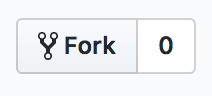
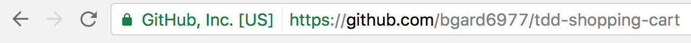

# Shopping Cart Lab

You have been hired as a developer at Ali Snobba - a snobby online store where customers purchase high-end merchandise like Gooey Baton handbags and Lolex watches. Your job is to implement a shopping cart that stores items while customers are in the process of ordering.

## The Test Cycle

As a developer, your task is to implement the following user story, following the TDD workflow:

- Write (failing) tests before writing any code
- Only write code in response to failing test
- Make tests pass with simplest code possible
- Make a commit in git each time you get a passing test
- After getting each test to pass, refactor
- Make another commit each time you finish a refactor

## Instructions

1. Fork this repository
2. Clone your new fork
3. Submit the link to your completed code in [Learn](https://learn-2.galvanize.com/cohorts/2328).

Once cloned, be sure to share the link to the new repository with your group! You'll both submit the same link to Learn for credit.

***Be sure to fork:***

***then Clone:***

***this repository!***

When you are finished with the exercise, [commit](https://www.atlassian.com/git/tutorials/saving-changes) and [push](https://www.atlassian.com/git/tutorials/syncing#git-push) your work!

You will know you have forked and pushed properly if you see your work in Github under your github account:

***not gSchool:***

***Be sure to make a commit in git each time you get a passing test!***

### Tips

* Establish rapport with your pair!
* Establish when you'll swap roles (ping pong)
* Take breaks at least once an hour.

## Acceptance Criteria:

Ali Snobba has given you the following criteria to determine completeness of your project. Note that there are no code implementation details. So you must collaborate with your partner on how best to implement the application.

1. Given that I a new shopper, when I begin shopping, then I expect my cart to be empty.
1. Given I have an empty cart, when I add an Item, then I expect to the price reflect the sum of all the Items in my cart.
1. Given I have cart with one item, when I add more of that item, then I expect to see its quantity update on the cart.
1. Given I have an empty cart, when I add items, then I expect it to see an itemized list of the items along with their price and quantity.
1. Given I have a cart with items that are not on sale, when I add an item that's on sale, I expect to see it highlighted.
1. Given I have a cart with items, when I remove an item, then I expect the cart to display the updated itemized list.
1. Given I have one item in my cart with a quantity of 3, when I remove one, then I expect the cart to have 2 of that item.

## Stretch Goals

If you get finished early, feel free to work towards these additions. This is not a exhaustive or exclusive list. Discuss with your pair what kind of improvements or changes you can make to this project.

- Add a UI of some kind
- Turn it into an API server so you can make requests against a shopping cart
- Store the data in a Database

## Additional Resources
- [Working with Currency](http://vanillajava.blogspot.de/2011/08/double-your-money-again.html)
- [String.format](https://dzone.com/articles/java-string-format-examples)
 
